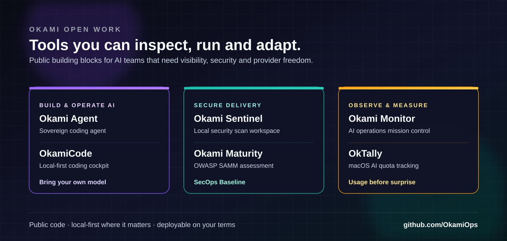

<div align="center">


<br />

<p align="center">
  <a href="https://okamiops.com"><b>Website</b></a>
  &nbsp;&nbsp;·&nbsp;&nbsp;
  <b>Public tools</b>
  &nbsp;&nbsp;·&nbsp;&nbsp;
  <b>On-premise delivery</b>
  &nbsp;&nbsp;·&nbsp;&nbsp;
  <b>São Paulo · Munich</b>
</p>

<p align="center">
  
  
  
</p>

<h2>Public tools for AI teams that need control.</h2>

</div>

---

## What we build

Okami publishes practical tools and delivers on-premise systems for teams building with AI. The work sits where product ideas start meeting operational reality: model choice, security boundaries, delivery gates, cost, observability and ownership.

Some projects are open source; others are public work with their own licensing terms. Run what fits your environment, inspect the code and adapt it to the way your team actually works.

> Useful AI. Security built into the architecture. Provider freedom. Evidence before scale.

<table>
  <tr>
    <td width="50%" valign="top">
      <h3>AI systems that stay operable</h3>
      <p>Local-first tooling, model-aware workflows, usage visibility and explicit operating boundaries.</p>
    </td>
    <td width="50%" valign="top">
      <h3>Secure delivery that leaves evidence</h3>
      <p>AppSec maturity, CI/CD security checks, scan workbenches and artifacts people can inspect later.</p>
    </td>
  </tr>
</table>

## Explore the public work



### Build and operate AI

- **[`Okami-Agent`](https://github.com/OkamiOps/Okami-Agent)** — A sovereign AI coding agent with provider-aware execution, persistent capabilities and terminal or Telegram operation.
- **[`OkamiCode`](https://github.com/OkamiOps/OkamiCode)** — A local-first desktop cockpit for native AI coding CLIs, communication, planning, usage intelligence and memory.
- **[`OkTally`](https://github.com/OkamiOps/OkTally)** — A macOS menu-bar tool for tracking AI coding subscription quotas before they become a surprise.

### Secure delivery

- **[`okami-SAMM`](https://github.com/OkamiOps/okami-SAMM)** — An OWASP SAMM v2 assessment workspace with scorecard, radar, prioritized roadmap and board-ready PDF report.
- **[`secops-baseline`](https://github.com/OkamiOps/secops-baseline)** — A practical CI/CD baseline for SCA, secrets, containers, IaC and auditable evidence.
- **[`okami-sentinel`](https://github.com/OkamiOps/okami-sentinel)** — A local-first workbench for running, comparing, reporting and gating OpenAI Codex Security scans.

### Run the business

- **[`Okami-Monitor`](https://github.com/OkamiOps/Okami-Monitor)** — Mission control for multi-agent AI environments: usage, cost, sessions, logs and external runtimes in one cockpit.
- **[`deskcomm-crm`](https://github.com/OkamiOps/deskcomm-crm)** — A self-hosted, open source AI sales OS with native agents, WhatsApp support and MCP-ready integrations.

Each repository has its own license, deployment notes and maturity level. Browse the [full public portfolio](https://github.com/OkamiOps?tab=repositories).

## How we ship


A useful proof of concept uses real inputs and produces numbers: quality, cost, latency, failure cases and a decision to proceed, change shape or stop. Production work adds boundaries, monitoring, rollback and clear ownership.

<details>
  <summary><b>What “provider freedom” means here</b></summary>
  <br />
  We design for explicit model routing, fallback behavior and evaluation across commercial APIs, open-source models and self-hosted deployments. The point is not to promise zero lock-in; it is to keep the decision visible and reversible.
</details>

## Technical posture


```yaml
okami:
  architecture: "multi-LLM, provider-aware"
  delivery: "risk map → controlled PoC → production gates"
  security: "AppSec + DevSecOps"
  evidence: "logs, tests, evals, runbooks, rollback"
  regions: ["São Paulo", "Munich"]
```

## Standards and frameworks we work with

<p>
  <code>LGPD</code>
  <code>GDPR</code>
  <code>ISO 27001</code>
  <code>OWASP SAMM</code>
  <code>OWASP ASVS</code>
  <code>NIST</code>
  <code>PCI-DSS</code>
</p>

## Principles

1. **Useful technology beats hype.** If it does not survive real inputs, it is decoration.
2. **Security belongs in the architecture.** It is not a panic meeting two days before launch.
3. **Compliance should produce evidence.** A control that nobody can inspect does not help much.
4. **Cost must be visible before scale.** AI without cost visibility turns into a billing surprise.
5. **The system must remain understandable.** Teams should know how it works after the first launch.

---

<div align="center">
  <sub>Okami — AI sovereignty, secure delivery and provider freedom for teams that need control, not theater.</sub>
</div>
